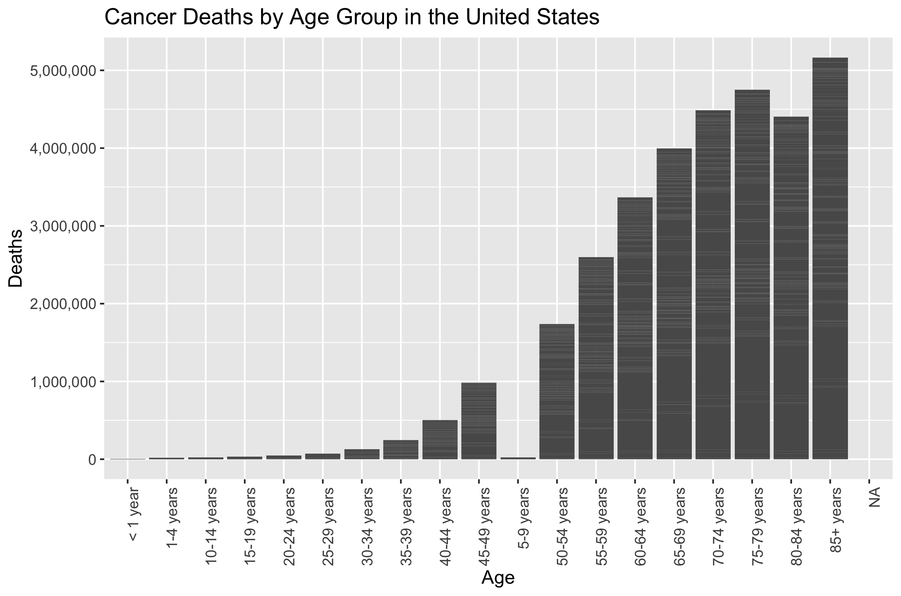
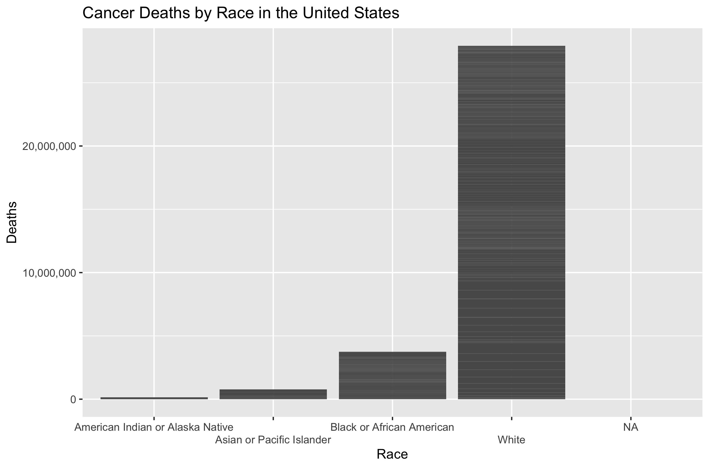
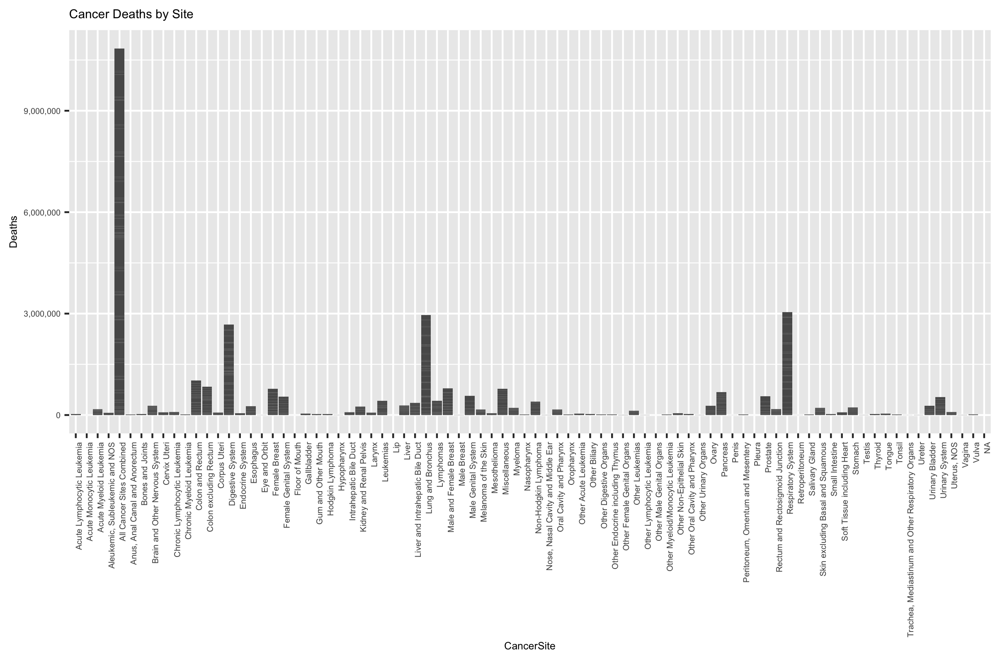
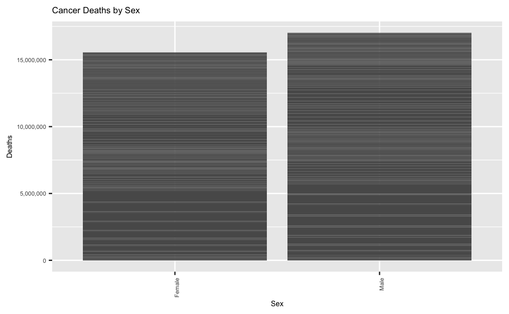

# Summary/Abstract

With an increasingly aging worlwide population, Cancer and its disease burden has become ever more important in the global sphere. In America in particular, where total cases from 2010 to 2020 were projected to increase by 24.2% [@Weir2015], increasing knowledge of possible interventions for the disease is of utmost priority. Cancer effects populations nationwide by being responsible for uncontrollable cell growth and metastases, as well as long-term decrease of life quality as a result of side effects of long-term care including chemotherapy. Cancer is also a disease that has established itself with disparities in several types of cancer being more highly concentrated to certain minority groups at a higher level than overall populations [@Zavala2021].  In this research project, data will be analyzed to further understand the trend of cancer mortality trends from 1999-2017 in the United States using data collected via the CDC wonder website. The goal of this project is to understand the role that age group, sex, ethnicity (characterized as hispanic or non-hispanic), and race play in the trend of overall rates of the disease nationwide, as well as to shed light on population groups that are of a higher need for directed health intervention. This research will allow for a greater understanding of populations that can experience the greatest positive impact from targeted health intervention. 


# Introduction 

## General Background Information

The word cancer has long been one of the most recognizable and fear-inducing words worldwide in the sphere of chronic disease. Cancer, along with heart disease and diabetes, are responsible for the leading causes of death and disability in the United States (according to the Center for Disease Control-https://www.cdc.gov/chronicdisease/about/index.htm#:~:text=Chronic%20diseases%20such%20as%20heart,disability%20in%20the%20United%20States). In 2012, there were an estimated 14.1 million new cancer cases with 8.2 million cancer deaths worldwide[@Torre2016]. Cancer also affects the elderly at a hightened rate,being the fourth highest cause of death for the very old,with people aged 85 and older making up 6% of total cancer cases[@Hashim]. Additionally, cancer disproportionately affects some racial and ethnic groups more than others, with Black patients being more likely to have metastatic disease at diagnosis as well as (along with the Hispanic population) being less likely to receive medical treatment[@Zhang2020]. 

  This disproportional effect to some races can also have increased effects for certain types of cancer. For instance, according to research done by [@Schabath2016], lung cancer in particular has "racial and ethnic differences which in turn impacts the overall epidemiological differences..."   All is not depressing however, as [@Ozdemir2017] states that while there are some discrepancies in how cancer effects different groups (with under representation of the Black population in clinical trials being one example), the use of the patient navigation model (where an individual is trained to offer support for patients in trials), has made a positive impact in improving health care access.   

  Because of the vast scope and many different types of the disease, resources and networks have been continually strained in identifying the most efficient and effective ways to counteract cancerous cells. While a multitude of research has already been conducted on cancer, understanding the differences in how the disease continues to affect and interact with different populations can serve as an invaluable resource in tailoring new innovative strategies to combat the disease.

## Description of data and data source
The data used in this project is a compilation of information regarding cancer mortality cases from 1999-2017 based on age group, sex, ethnicity. race, and cancer sites (*note that this data only includes information collected from the United States*). The data is composed of 8809 observations and was retrieved from the CDC wonder website which can be found here: 

*https://wonder.cdc.gov/cancermort-v2017.HTML

## Questions/Hypotheses to be addressed

Cancer has been and will continue to be widely studied- however, with the presence of constantly evolving data and new research shedding light on innovative techniques and approaches to better manage and control the disease, new examinations of data trends can provide a valuable framework for future studies. With that being said, there are several questions in particular that I will ask and attempt to answer throughout this research project:

*Are cancer mortality trends dependent on or affected by race in the United States? If so, in what ways?*

*How does age factor into mortality trends of cancer? Will the past research concluding that the elderly are the most vulnerable continue to be held evident?*

*Does ethnicity play a role in either further susceptibility or resilience to cancer (more or less cancer deaths for certain ethnic groups)? If there is a difference between trends for certain ethnicities in the overall disease burden why would that be the case? (E.G. Presence of a good support system or lack thereof, high religious affiliation, healthier overall living, etc.)*

*Does the particular cancer site have an affect on the outcome of the disease? If so, what sites have the largest mortality relative to the number of cases?*

In addition to these supplementary questions, our main hypothesis will focus around the potential role that race and ethnicity plays in cancer rates, and in particular, that there is a measurable and distinct effect on cancer rates as a result of race and ethnicity.

These aforementioned questions will serve as valuable starting points that, if possible, will allow for deeper data analysis to determine synergy between variables (do certain races or ethnicities have a higher propensity for cancer in certain sites? Are there trends between sex and age group relative to cancer mortality trends?). While some of these questions posed may not be able to be fully explored and answered with the data set utilized here, further research in topics of interest will elucidate these questions and allow for a greater reinforcement of already established research and data analysis regarding cancer and its disease burden.

# Methods and Results
The data was gathered from the CDC's Wonder website, which allows for personalized public health information depending on what's desired. As the research in this project focuses on sex, age, ethnicity, and sex, those are the four variables that were chosen to compile the original data set, in addition to a few miscellaneous variables that were deemed superfluous and removed, these included mainly ID numbers that corresponded with the data retrieved. In addition, the original data was cleaned by removing all NA variables from the data set after selecting the desired variables for the research project. The selected variables include: Age, Sex, Deaths (Cancer), Ethnicity (Hispanic or Non-Hispanic), Race, and Cancer Site. 

## Data aquisition and cleaning
As previously stated, the data for this research project was retrieved from the CDC Wonder database. This database was chosen due to the reputable source of the Center for Disease Control, as well as the high quality of reporting and information reported that can be depended on for its reliability and authenticity.

The data had several features removed for sake of more pertinent analysis, as well as the number of observations decreased from 8809 to 8752 due to removal of all NA variables.


#As can be seen from the chart the population is largely composed of older 
#adults between the ages of 50-85
     
#Now the sex of the data set:
mydata %>% ggplot(aes(x = Sex)) + geom_bar()

#The chart shows that this data set is almost exactly equal in terms of number
# of male and female 

#Next we will examine the race of the data set:
mydata %>% ggplot(aes(x = Race)) + geom_bar() +
scale_x_discrete(guide = guide_axis(n.dodge = 2))

#As can be seen from the data, we are working with a majority White population
#with a moderate amount of African American and a lower amount of Asian or 
#Pacific Islander and American Indian or Alaska Native

#Now ethnicity:
mydata %>% ggplot(aes(x = Ethnicity)) + geom_bar() 

#This chart shows us that the data is composed of a mostly non-Hispanic 
#population, with Hispanic as the second most common followed by some unknown or
#missing

#Finally cancer sites:
mydata %>% ggplot(aes(x = CancerSite)) + geom_bar() +
  scale_x_discrete(guide = guide_axis(n.dodge = 1)) +
  theme(text = element_text(size = 8, face = "bold"),
        axis.text.x = element_text(angle = 90, hjust = 1))

#It seems as though the largest number of cancer cases are localized to the 
#digestive system, lung and bronchus, and respiratory system, with a large number 
#of cases considered to be miscellaneous

Now that we have completed a preliminary look at our predictors of interest,
we will examine a closer look at the data to see if any basic trends 
can be seen, with the first plot, we will be examining cancer deaths and 
race to see if there exists any trends

## Full analysis
Race and Ethnicity were assessed to determine any statistical significance relating to Deaths (cancer deaths), utilizing a comparison between a null model and 1. Single Tree, 2. LASSO, and 3. Random Forest models. 

Since almost all of the data used in this project was categorical, the  "classification" instead of "regression" method was adopted to ensure easier analysis of variables. Five fold cross-validation was used to ensure accurate results. R version 4.1.1 was used for the project.

# Results
Results were inconclusive, all three model types experiences complete failure of generated models, thus there was no apparent significance between race, ethnicity, and cancer deaths. 

Some information was gathered however, regarding basic exploratory analysis of the gathered data relating to age, race, cancer site, and sex, which are displayed here:

```{r AgeGroup,  fig.cap='\\label{fig::distribution}Cancer Deaths by Age Group', echo=FALSE}

```


```{r Race,  fig.cap='\\label{fig::distribution}Cancer Deaths by Race', echo=FALSE}

```


```{r Site,  fig.cap='\\label{fig::distribution}Cancer Deaths by Site', echo=FALSE}

```

```{r Sex,  fig.cap='\\label{fig::distribution}Cancer Deaths by Sex', echo=FALSE}

```
## Discussion
While the modeling was inconclusive that race and ethnicity play a role in cancer rates and death, the exploratory analysis indicates that there is a much higher prevalence of overall cancer death in the White population group, with the African American experiencing the second most overall. 

In terms of most common age group, age appears to have a direct link with an increased risk of developing cancer. In terms of sex, men appear to have more overall cases of cancer death than females.

Finally, when examining overall cancer sites, lung and bronchus folowed by the respiratory system were the two most common locations overall to develop cancer, with the digestive system being the third highest.

## Summary and Interpretation
Overall, while no models were conclusive as to establishing a causal link between race, ethnicity, and cancer rates and deaths, there appears to be a distinct difference in overall disease burden between race groups, age groups, sex, and location, more research on race and ethnicity and how it relates to the burden of disease of certain population group should be pursued further to determine if a causal link exists.

## Strengths and Limitations
Strengths of the analysis are that the data comes from the Center for Disease Control, which enables the retrieval and usage of accurate and highly valuable public health data. Additionally, by focusing on "classification" rather than "linear regression" in determining statistical significance, there exists potential to identify causality and statistical significance between categorical factors rather than the usual numerical.

## Conclusions
In conclusion, ethnicity and race, while no clear evidence was proven in this case, appear to both have a tangible and measurable impact on the disease burden of a community, either directly through cultural stigma and institutionalized norms, or indirectly through averages of socioeconomic status and community networks, more research needs to be done to conclusively determine the presence of and extent of this potential relationship, or if the two features are simply confounders to another greater driver.


# References